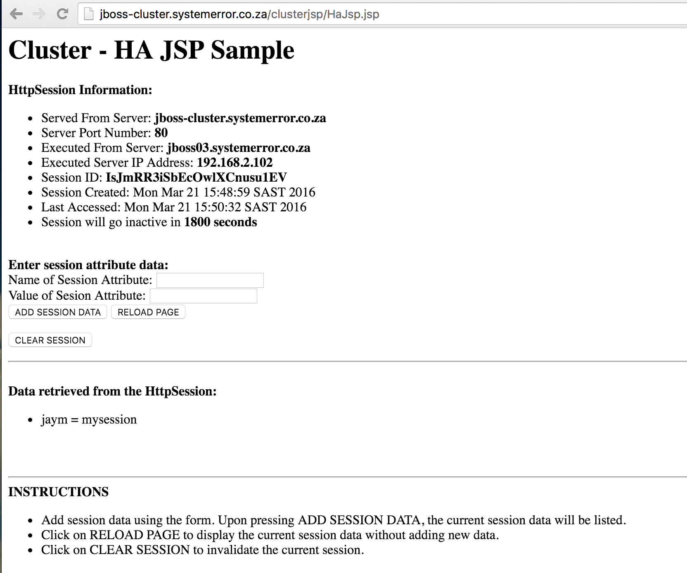

## Table of Contents

* [About](#about)
* [Cluster JBoss Deployment](#cluster-jboss-deployment)
* [Usage](#usage)
* [Playbook execution](#playbook-execution)
* [NGINX Reverse Proxy](#nginx-reverse-proxy)
* [Troubleshooting](#troubleshooting)
* [Demo](#demo)

## About



- Orchestrates the deployment of a 3 node JBOSS EAP 6.2 Cluster with session replication.
- The OS configured/maintain by puppet - see https://gitlab.com/jayendren/puppet-ng/blob/develop/manifests/classes/baseline.pp
- The deployment uses ansible for orchestration, and docker (NGINX) for loadbalancing.
- The cluster is tested using waitr - see https://gitlab.com/jayendren/ansible-jboss-cluster/blob/develop/waitr/cluster_session_test.rb

## Cluster JBoss Deployment

- Requires Ansible 1.2 or newer
- Expects CentOS/RHEL 6.x hosts
- Docker host running docker 1.6 or later

The ansible playbooks deploy a 3 node clustered JBoss Application Server

 - Deploys jdk-8u60-linux-x64 and sets install as default java (update-alternatives)
 - Deploys jboss-eap-6.2:
	 - The first node is the Domain Controller, 
	 - The remaining nodes are slaves (Domain Controller Members)
	 - Session replication is enabled using default-cache="repl"
 - Demo clusterjsp app is deployed to test session replication
 	- See waitr/cluster_session_test.rb 

## Usage

 * First edit the "hosts" inventory file to contain the hostnames of the machines on which you want JBoss deployed, 
 * Edit the group_vars/jboss-servers file to set any JBoss configuration parameters you need.
 * Create user accounts for each node using the JBOSS EAP add-users.sh shell script.
   * Update roles/jboss-cluster/host-slave:

```
↑130 (jboss01.systemerror.co.za) jboss-eap-6.2/bin → ./add-user.sh

What type of user do you wish to add?
 a) Management User (mgmt-users.properties)
 b) Application User (application-users.properties)
(a): a

Enter the details of the new user to add.
Using realm 'ManagementRealm' as discovered from the existing property files.
Username : jboss01.systemerror.co.za
Password :
Re-enter Password :
What groups do you want this user to belong to? (Please enter a comma separated list, or leave blank for none)[  ]:
About to add user 'jboss01.systemerror.co.za' for realm 'ManagementRealm'
Is this correct yes/no? y
Added user 'jboss01.systemerror.co.za' to file '/opt/jboss1/jboss-eap-6.2/domain/configuration/mgmt-users.properties'
Added user 'jboss01.systemerror.co.za' with groups  to file '/opt/jboss1/jboss-eap-6.2/domain/configuration/mgmt-groups.properties'
Is this new user going to be used for one AS process to connect to another AS process?
e.g. for a slave host controller connecting to the master or for a Remoting connection for server to server EJB calls.
yes/no? y
To represent the user add the following to the server-identities definition:

                <server-identities>
                    <secret value="LC56YXhzLy9DMw=="/>
                </server-identities>
```

* Update roles/jboss-cluster/mgmt-users.properties

```
admin=ae1acfc53a86911cd394f2529d2c2f46
jboss01.systemerror.co.za=28e029767f72dc50b868e50e0a5c76bc
jboss02.systemerror.co.za=a14f725b396a9761ddff7e7db6f15852
jboss03.systemerror.co.za=212337f0b8b85c4deb27ac3f7d02e809
```       

* Update roles/jboss-cluster/group_vars/jboss-servers

```
jboss_domain_login_password: p\@SSw0rd
```

### Playbook execution

- Run playbook

```
	ansible-playbook -i hosts site.yml
```

- When the playbook run completes, you should be able to see the JBoss
Application Server running on the ports you chose, on the target machines.

- The cluster will bootstrap and deploy the clusterjsp app - http://cluster-host/clusterjsp

### NGINX Reverse proxy

Included in this project is a docker container to load balance traffic between the jboss cluster nodes.

* Edit docker-nginx-revproxy/src/revproxy.conf and update the backend servers
 - The server ports are defined ``group_vars/jboss-servers:jboss_http_port`` during deployment

```
  upstream jboss_cluster {
      ip_hash;
      server 192.168.2.101:9180 max_fails=1 fail_timeout=1s weight=4;
      server 192.168.2.102:9180 max_fails=1 fail_timeout=1s weight=4;
      server 192.168.2.100:9180 max_fails=1 fail_timeout=1s weight=1;
  }
```

* Update server_name

```
  server {
    listen       80;
    server_name  jboss-cluster.systemerror.co.za;
```

* Build the container

``
docker build -t nginx-jboss-revproxy .
``

* Run the container

```
/usr/bin/docker run --name nginx-jboss-revproxy \
-p 80:80 \
-v /nas/docker/nginx/jboss_cluster_syserr.conf:/etc/nginx/nginx.conf \
nginx-jboss-revproxy
```

* Optionally autostart using systemd

  	-  Edit docker-nginx.service and update ``/nas/docker/nginx/jboss_cluster_syserr.conf:/etc/nginx/nginx.conf`` 
  	with the full path to docker-nginx-revproxy/src/revproxy.conf
  	- Add unit and start

  ```
  cp docker-nginx.service /lib/systemd/system/ && \
  systemctl enable docker-nginx.service && \
  systemctl start docker-nginx.service && \
  journalctl -f -u docker-nginx.service
  ```

* Based on the above config - you can access the clusterjsp app via http://jboss-cluster.systemerror.co.za/clusterjsp

### Troubleshooting

* The following aliases have been configured under the jboss user (e.g su - jboss1)

```
psjbossdom
startjbossmaster
startjbossmember
stopjbossmaster
stopjbossmember
tailjbossdom
```

### Demo

* TODO